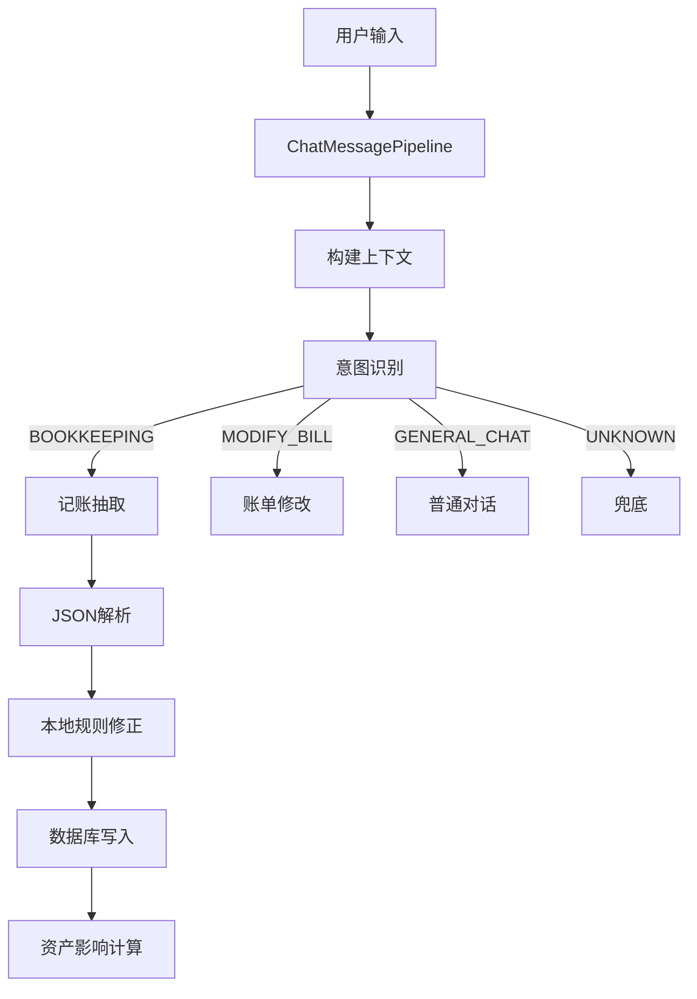

# Flip Accounting

Flip Accounting 是一款 **AI 驱动的 Android 记账应用**。

它不是传统表单式记账工具，而是围绕：

> **自然语言 / 语音 / 图片 / 截图 → AI 理解 → 结构化账单 → 本地执行**

构建的一套轻量级 Agent 工作流。

---

## ✨ 核心能力

### 🧑‍💻 用户视角

- **自然语言记账**  
  输入：`早餐 12，地铁 4` → 自动拆分多条账单

- **语音记账**  
  支持录音 / 直接音频理解

- **图片 / 小票 / 截图记账**  
  OCR + 多模态解析账单信息

- **上下文账单修正**  
  支持：

    - “刚刚那笔”

    - “上一笔改成 40”

- **资产 / 分类管理**

- **悬浮窗快速记账**


---

### ⚙️ 技术视角

- LLM 负责：

    - 意图识别

    - 信息抽取

    - 上下文理解

- 本地系统负责：

    - JSON 校验

    - 规则修正

    - 数据落库

- 使用 **固定 JSON Schema** 连接 AI 与业务逻辑


---

## 🧠 Agent 架构设计

### 架构类型

> **Single Agent + Workflow Orchestration**

---

### 🔁 工作流



---

## 🔍 核心模块

### 1. 意图识别（Routing）

支持意图：

```json
{
  "intent_type": "BOOKKEEPING",
  "confidence": 0.9,
  "bookkeeping_mode": "MULTI"
}
```

- 模型优先

- 本地规则 fallback

- 支持上下文表达（刚刚那笔）


---

### 2. 信息抽取（Extraction）

#### 单账单

```json
{
  "amount": 12.5,
  "type": 0,
  "category_name": "餐饮",
  "remarks": "早餐"
}
```

#### 多账单

```json
{
  "bills": [
    { "amount": 12, "category_name": "餐饮" },
    { "amount": 4, "category_name": "交通" }
  ]
}
```

#### 无账单

```json
{
  "no_bill": true,
  "reply": "未识别到可记账内容"
}
```

---

### 3. 上下文理解（Context）

支持：

- “刚刚那笔”

- “上一笔”

- “改成微信支付”


→ 自动定位并修改账单

---

### 4. 工具调用（本地执行）

```text
JSON → Bill → DAO → DB → Asset Impact
```

关键组件：

- `BillMutationService`

- `AppDatabase`

- `BillAssetImpactService`


---

## 🚀 使用示例

### 示例 1：多账单

```
早餐 12，地铁 4
```

→ 自动拆分两笔

---

### 示例 2：修改账单

```
刚刚那笔改成 40
```

→ 修改上一条记录

---

### 示例 3：语音记账

```
今天午饭 28，打车 42
```

→ 自动拆分 + 入库

---

## 🧩 技术栈

- Kotlin / Android

- Room

- Retrofit / OkHttp

- Coroutines

- ML Kit OCR

- sherpa-onnx (语音)

- MPAndroidChart


---

## 📂 项目结构

```bash
Flip_Accounting/
├── app/
│   ├── AIService.kt
│   ├── ChatMessagePipeline.kt
│   ├── chat/ai/
│   │   ├── AiIntentRouter.kt
│   │   └── AiIntentModels.kt
│   ├── data/local/
│   │   ├── AppDatabase.kt
│   │   └── dao/
│   ├── logic/
│   │   ├── BillMutationService.kt
│   │   └── BillAssetImpactService.kt
│   └── ui/
```

---

## ⚠️ 当前边界

- 单 Agent（非多 Agent）

- 暂未实现自然语言查账执行器

- 依赖外部 LLM API

- 无 LICENSE


---

## 🔧 后续扩展方向

- 自然语言查账（QUERY → DB）

- Tool 抽象（Agent Tool）

- 低置信度确认机制

- Prompt / Schema 版本管理

- 测试体系


---

## 总结一句话

> Flip Accounting = **LLM + JSON + 本地执行引擎的记账 Agent**

---
